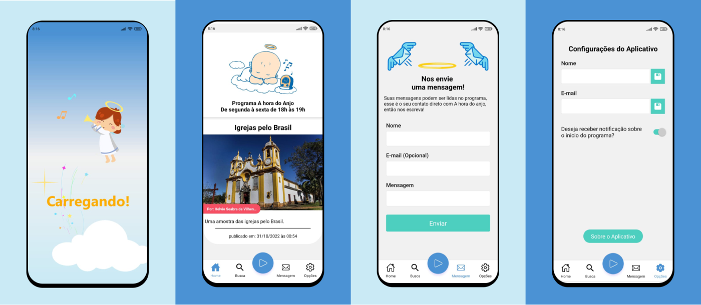

<h1 align="center">
  
</h1>

<p align="center">
  <a href="#features">Features</a>&nbsp;&nbsp;&nbsp;|&nbsp;&nbsp;&nbsp;
  <a href="#technologies">Technologies</a>&nbsp;&nbsp;&nbsp;|&nbsp;&nbsp;&nbsp;
  <a href="#getting-started">Getting started</a>&nbsp;&nbsp;&nbsp;|&nbsp;&nbsp;&nbsp;
  <a href="#project">Project</a>&nbsp;&nbsp;&nbsp;|&nbsp;&nbsp;&nbsp;
  <a href="#application">Application</a>
</p>

<br>

<p align="center">
  
</p>

---

## Features

- [x] Read post
- [x] Send message to radio
- [x] Listen to the radio live
- [x] Radio notifications

## Technologies

This project was developed using the following technologies:

- [React Native](https://reactnative.dev/)
- [Expo bare workflow](https://expo.io/)
- [TypeScript](https://www.typescriptlang.org/)
- [TanStack Query](https://tanstack.com/query/latest)

## Getting started

Clone the project and access the folder

```bash
$ git clone https://github.com/HelvioFilho/mobile-ahda && cd mobile-ahda
```

Follow the steps below
```bash
# Install the dependencies
$ npm install

# Start the project
# Android
$ expo run:android 

# IOS
expo run:ios
```

## Project

Radio application A hora do Anjo, a radio station created in Novo Repartimento, a city in the interior of Pará, Brazil.


## Application

Download the application from the play store.

<a href="https://play.google.com/store/apps/details?id=com.ahda">
  
</a>